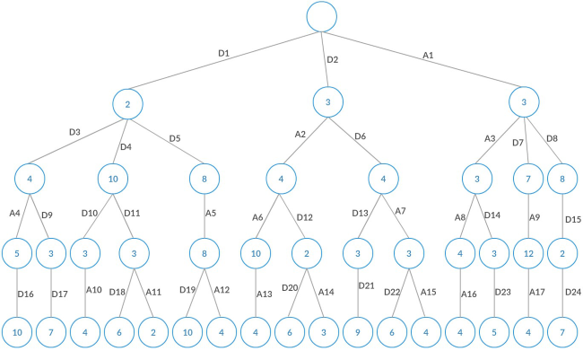

# MinimaxAlgorithm
Mini max algoritması kullanılarak hazırlanan kod parçasıdır.

Karar ağacında kullanılması için iki algoritma mevcuttur. Bu algoritmalar minimax algoritması için belirlenmiş fonksiyonların çeşidini ifade eder.

Neden bu algoritmalar tasarlanmıştır?
Senaryo gereği iki oyun karakteri konuşmalarının Min-max Algoritmasına göre çalışması için gerekli hesaplamaların yapılmasını sağlayan bir formüle ihtiyaç vardır. Çünkü bu karakterler sadece bir değere değil birçok farklı değeri değerlendirmelidir. Karakterler’nin farklı iki temel ruh halini göstermesi için hesaplamaların birbirinden farklı uygulandığı algoritmalar belirlenmiştir. Oyun karakterlerinin ayrımını kolaylaştırmak amacıyla isimleri 'Rex' ve 'Mike' olarak belirlenmiştir. Burada 'Rex' karakteri cengaver sınıfında, 'Mike' karakteri ise düzenbaz sınıfına dahildir. bu sınıf farkı formül içeriğiyle belirlenmiştir.

### 1.Aggressive Algoritma
Bu algoritma, karakterin ne kadar hasar alacağını umursamadan karşı tarafa en yüksek kaybı verdirtmektir. Böylece karakter kendisinin ne kadar hasar alacağı durumunu hesaba katmadan zarar vermeyi amaçlamış olur. 

X: Her action için etkilenme katsayısı(sabit) 
A: Karakterin yaptığı action değeri 
Y: Her diplomatik hareket için etkilenme katsayısı(sabit) 
D: Karakterin yaptığı diplomasi değeri 

Burada “XMc” ifadesi Mike karakterinin cengaver sınıfından her action için ne kadar etkileneceğini belirten katsayıdır. Yani Mike karakteri için farklı cengaver karakterlerinde dahi değişmeyen katsayıdır. “YMc” değeri ise her diplomasi değeri için Mike’nin etkienme değerini ifade eder. Geri kalan “AR” ve “DR” değerleri Rex karakterine aittir. Benzer şekilde “XRd” ve “YRd” ifadeleri Rex karakterinin düzenbaz sınıfından olan bir karakterden action ve diplomasi için etkilenme katsayılarıdır. Geri kalan sabitler ve değişkenler ise Mike’ye aittir.

### 2. Defensive Algoritma
Bu algoritma gerçeğe en uygun şekilce çıktı vermesi amacıyla Passive Algoritmanın geliştirilmesiyle hazırlanmıştır. Burada karakter karşı tarafa zarar verirken kendi alacağı zararı en aza indirmeyi amaçlamaktadır.

z: Karakterin yorgunluk katsayısı(sabit) 
E: Yapılan her action için etkilenme değeri 

Burada “zR” ve “ER” değerlerinin tamamı Rex karakterine aittir. "zM" ve "EM" değerleri ise Mike karakterine ait değerlerdir. E değişkeni ise action anlamına gelen A değerinin yarısına eşit olacak şekilde hesaplanmıştır. z değerleri ise bir karakter için daima aynı değere sabittir. Bu değerler ile karakterin yapmış olduğu her hamle için yorgunluk değerini ana değerden düşürerek daha gerçekçi değerler elde edilebilmesi amaçlanmıştır. 

Tasarlanan bu formüller ile minimax ağacı çizilmiş ve yapı tamamlanmıştır.

Görüleceği gibi Mini-Max ağacı en fazla üç çocuk düğüme sahip olcak şekilde tasarlanmıştır. Düğüm yapısı içinde bir parent, üç çocuk düğüm, bir value değeri, bir isim değeri, bir action, diplomasi ve exhaustion değeri içermektedir. Her yaprak düğümünün sahip olduğu value değerininin, o düğümün parentlerinin value değerleriyle toplamından elde edilen sonuçların karşılaştırılmasıyla bir sonuç belirlenir.
